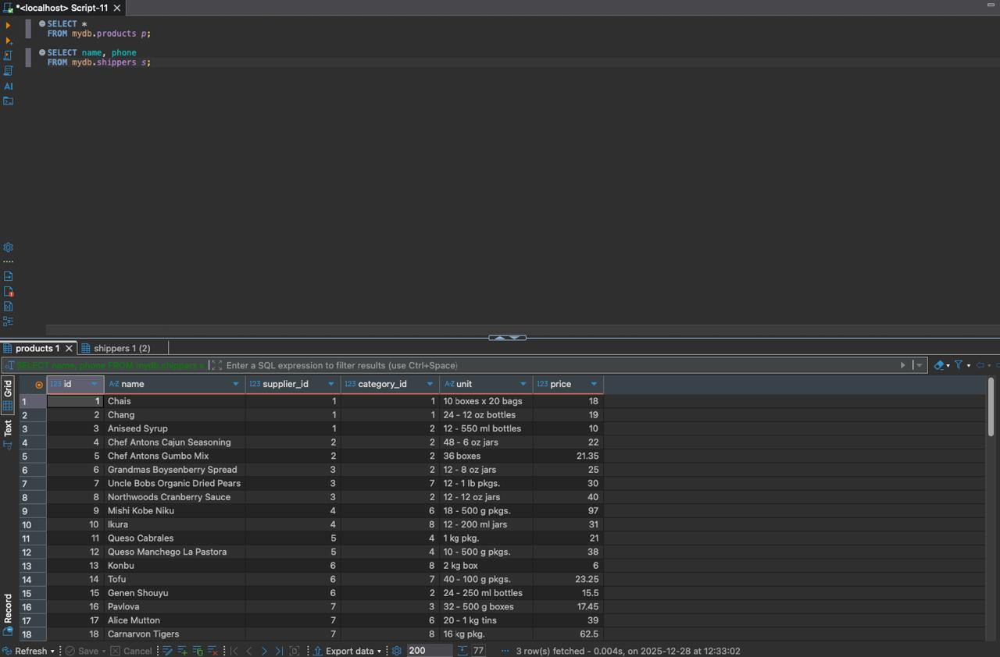
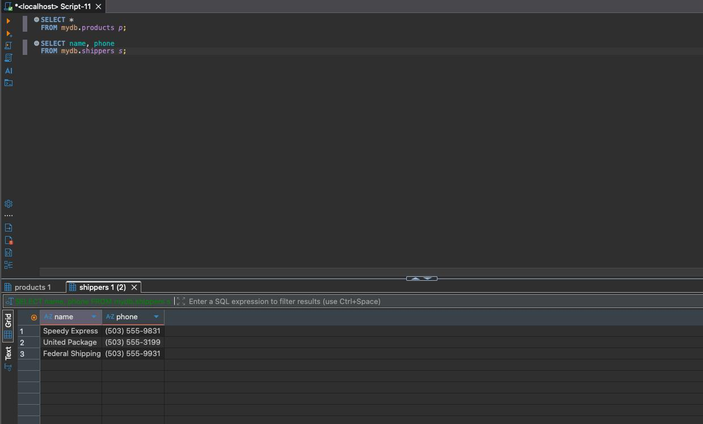
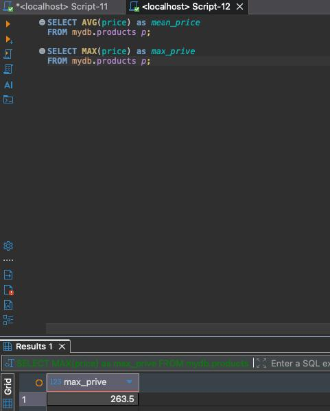
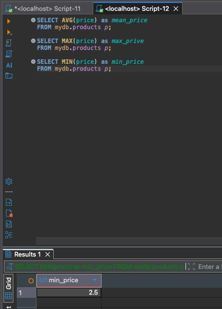
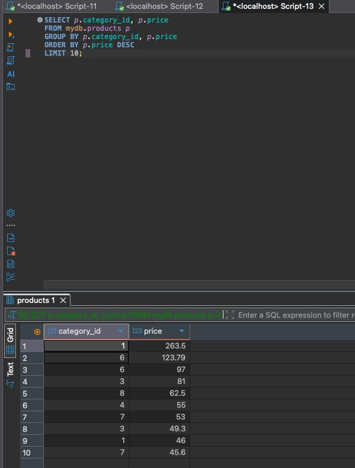
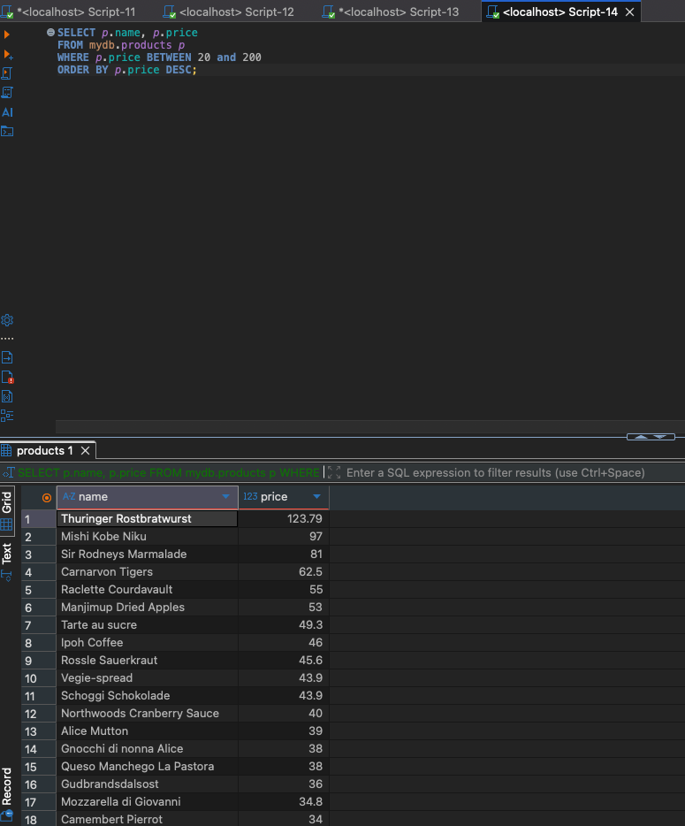
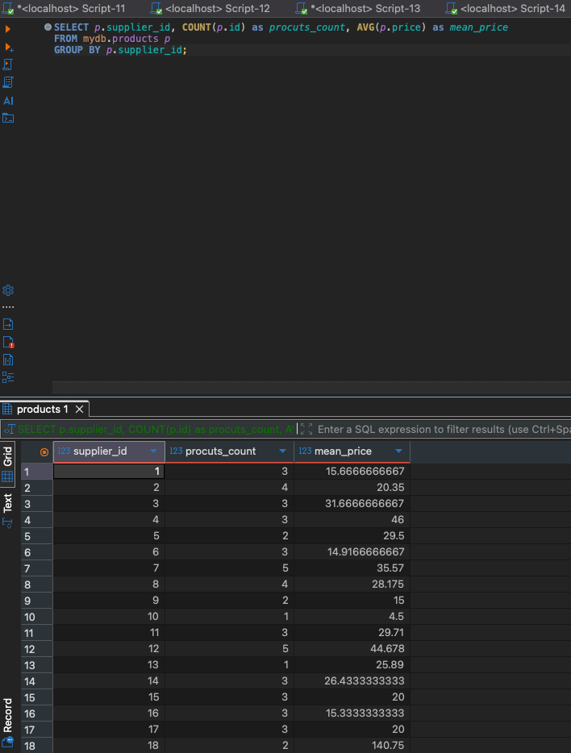

## Home Work 3

### Task 1
```sql
SELECT *
FROM mydb.products p;

SELECT name, phone
FROM mydb.shippers s;
```




### Task 2
```sql
SELECT AVG(price) as mean_price
FROM mydb.products p;

SELECT MAX(price) as max_prive
FROM mydb.products p;

SELECT MIN(price) as min_price
FROM mydb.products p;
```






### Task 3
```sql
SELECT p.category_id, p.price
FROM mydb.products p 
GROUP BY p.category_id, p.price
ORDER BY p.price DESC
LIMIT 10;
```



### Task 4
```sql
SELECT p.name, p.price 
FROM mydb.products p
WHERE p.price BETWEEN 20 and 200
ORDER BY p.price DESC;
```



### Task 5
```sql
SELECT p.supplier_id, COUNT(p.id) as procuts_count, AVG(p.price) as mean_price
FROM mydb.products p
GROUP BY p.supplier_id;
```

